Examples Using the hs._asm.canvas Module
========================================

This document provides some examples which highlight graphical elements possible with this module.

### Contents
* <a href="#clipping">Clipping Example</a>
  * <a href="#canvasTransformation">adding a canvas transformation</a>
* <a href="#bezier">Bezier Curve Example</a>
  * <a href="#rotation">adding a element rotation</a>
  * <a href="#mouseEnterExit">adding mouse enter and exit</a>
* <a href="#gradients">Gradients and Composite Rules</a>
* <a href="#segments">Segments and Points</a>
  * <a href="#changingSegments">... that change</a>
* <a href="#asImage">Using a Canvas as an Image for Other Modules</a>
* <a href="#final">Final Notes</a>

### Clipping Example

This example shows how to create a clipping region which contains a hole.  Clipping regions are regions which designate where graphical content is actually rendered.  Creating a region with a hole in it requires multiple steps.  Take a look at the following code:

~~~lua
c = require("hs._asm.canvas")
a = c.new{x=100,y=100,h=500,w=500}:appendElements( {
-- first we start with a rectangle that covers the full canvas
    action = "build", padding = 0, type = "rectangle"
  }, {
-- then we append a circle, but reverse its path, so that the default windingRule of `evenOdd` sees this as a negative region
    action = "build", padding = 0, radius = ".3", reversePath = true, type = "circle"
  }, {
-- and we end it it with a smaller circle, which should show content
    action = "clip", padding = 0, radius = ".1", type = "circle"
  }, {
-- now, draw a rectangle in the upper left
    action = "fill",
    fillColor = { alpha = 0.5, green = 1.0  },
    frame = { x = "0", y = "0", h = ".75", w = ".75", },
    type = "rectangle",
    withShadow = true,
  }, {
-- and a circle in the lower right
    action = "fill",
    center = { x = "0.625", y = "0.625" },
    fillColor = { alpha = 0.5, red = 1.0  },
    radius = ".375",
    type = "circle",
    withShadow = true,
  }, {
-- reset our clipping changes added with elements 1, 2, and 3
    type = "resetClip"
  }, {
-- and cover the whole thing with a semi-transparent rectangle
    action = "fill",
    fillColor = { alpha = 0.25, blue = 0.5, green = 0.5  },
    frame = { h = 500.0, w = 500.0, x = 0.0, y = 0.0 },
    type = "rectangle",
  } ):show()
~~~

This will result in the following image:

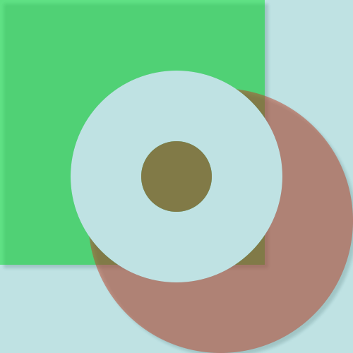

Notice that the shadow of the lower right circle is cut off at the canvas edges.  We can adjust that by setting a value for the canvas `padding`:

~~~lua
a:canvasDefaultFor("padding", 10)
~~~

Now, it looks like this:

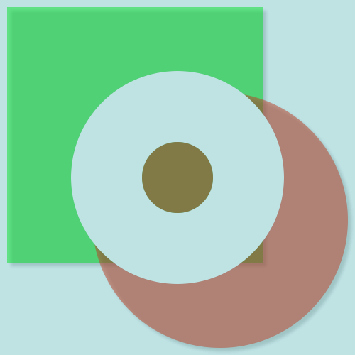

The following code shows how the "origin" of the canvas can be changed under programatic control -- this example uses changes in the mouse pointers position and will move the contents of the canvas until you type `y = true` into the Hammerspoon console:

~~~lua
local sp = hs.mouse.getAbsolutePosition()
y = false ;
hs.timer.doWhile(function() if y == true then
        a:transformation(nil)
    end
    return not y
end, function()
    local cp = hs.mouse.getAbsolutePosition()
    a:transformation(c.matrix.translate(cp.x - sp.x, cp.y - sp.y))
end, .01)
~~~

- - -

### Bezier Curve Example

(Note, if you are trying these out yourself, clear out the previous example with `a:delete()` before moving to the next one.)

Using the `segments` type, we can generate a variety of shapes that are difficult to create as combinations of other primitive objects.  For example:

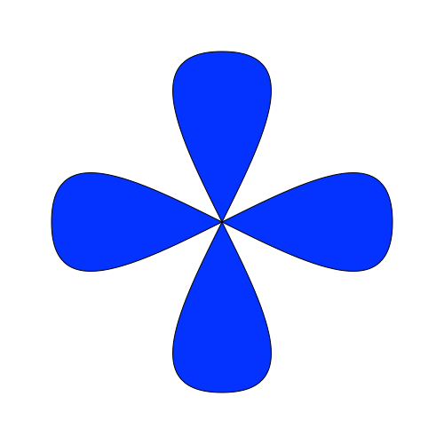

This was provided with the following code (this also shows the use of the metamethods which allow treating a canvas object in an array-like manner):

~~~lua
c = require("hs._asm.canvas")
a = c.new{ x = 100, y = 100, h = 500, w = 500 }
a[1] = {
  coordinates = {
    { x = ".1", y = ".5" },
    { x = ".9", y = ".5", c1x = ".1", c1y = ".1", c2x = ".9", c2y = ".9" },
    { x = ".1", y = ".5", c1x = ".9", c1y = ".1", c2x = ".1", c2y = ".9" },
  },
  fillColor = { blue = 1 },
  type = "segments",
}

a[2] = {
  coordinates = {
    { x = ".5", y = ".1" },
    { x = ".5", y = ".9", c1x = ".1", c1y = ".1", c2x = ".9", c2y = ".9" },
    { x = ".5", y = ".1", c1x = ".1", c1y = ".9", c2x = ".9", c2y = ".1" },
  },
  fillColor = { blue = 1 },
  type = "segments",
}

a:show()
~~~

You can also rotate a canvas elements by changing its transformation as follows (stop the rotation by typing `y = true` into the Hammerspoon console):

~~~lua
y = false
z = 0
hs.timer.doWhile(
    function() return y ~= true end,
    function()
        -- the following 3 lines could also be replaced with a:rotateElement(2, z)
        local sz = a:size()
        a:rotateElement(2, z)
        a[2].transformation = c.matrix.translate(sz.w / 2, sz.h / 2)
                                      :rotate(z)
                                      :translate(sz.w / -2, sz.h / -2)
        z = z + 10
    end,
.1)
~~~

An example of mouseEnterExit tracking can be added:

~~~lua
a:mouseCallback(function(canvas, event, id, x, y)
    if event == "mouseEnter" then
        if id == 1 then
            a[1].fillColor = { red = 1 }
        elseif id == 2 then
            a[2].fillColor = { green = 1 }
        end
    elseif event == "mouseExit" then
        a[id].fillColor = { blue = 1 }
    end
end)
a._default.trackMouseEnterExit = true
~~~

Note that if you apply this while element 2 is still rotating, the region which matches element 2 does get adjusted as the element rotates, but the rotating itself does not constitute a mouse movement: if your mouse enters and exits the moving element under your control, the color change will occur; however if it leaves because the image rotates away from the mouse pointer, no mouse event is actually generated, so we can't detect it.

- - -

### Gradients and Composite Rules

This module also supports radial and linear gradients, but is not limited to just 2 colors.  As an example:

~~~lua
c = require("hs._asm.canvas")
a = c.new{x = 100, y = 100, w = 200, h = 200 }:show()
a[1] = {
  type="image",
  -- the Hammerspoon menu icon has this name within the Application bundle, so we can get it this way:
  image = hs.image.imageFromName("statusicon")
}
a[2] = {
  type = "rectangle",
  action = "fill",
  fillGradientColors = {
    { red = 1 },
    { red = 1, green = .65 },
    { red = 1, green = 1 },
    { green = 1 },
    { blue = 1 },
    { red = .30, blue = .5 },
    { red = .93, green = .5, blue = .93 }
  },
  fillGradient = "radial"
}
~~~

The above will render the following canvas:

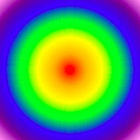

If you look closely at the code above, you'll see that the gradient filled rectangle is actually the *second* object.  This was done to show some of the effects available by changing the compositing rule.  For example:

~~~lua
a[2].compositeRule = "sourceOut"
~~~
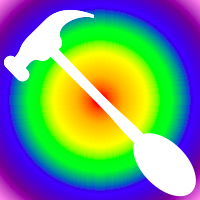

~~~lua
a[2].compositeRule = "destinationIn"
~~~

~~~lua
a[2].compositeRule = "destinationOver"
~~~
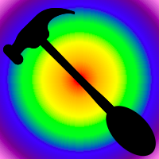

~~~lua
a[2].compositeRule = "sourceAtop"
~~~
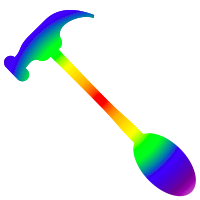

You can find more information about the compositing rules in the documentation for `hs._asm.canvas.compositeTypes`.

And to animate the gradient (end it with `t:stop()`):

~~~lua
local m, n = 0, .1
t = hs.timer.doEvery(.1, function()
  m = m + n
  if m > 1 then
    m, n = 1, -.1
  elseif m < -1 then
    m, n = -1, .1
  end
  a[2].fillGradientCenter = { x = m, y = m }
end)
~~~

- - -

### Segments and Points

This example takes advantage of the fact that every field of an element, including its type, can be changed at any time.

The following code:

~~~lua
c = require("hs._asm.canvas")
a = c.new{ x = 100, y = 100, h = 500, w = 500 }:show()
a[1] = { type = "segments", closed = false, strokeColor = { blue = 1 }, action = "stroke", strokeWidth = 2 }
local z = {} ; for i = 0, 500, 10 do table.insert(z, { x = i, y = math.random(500) }) end
a[1].coordinates = z
~~~

Will render something like this:

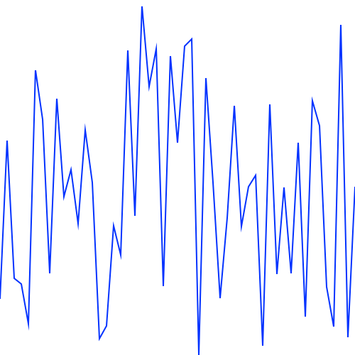

But by simply entering `a[1].type = "points"`, it switches to this:

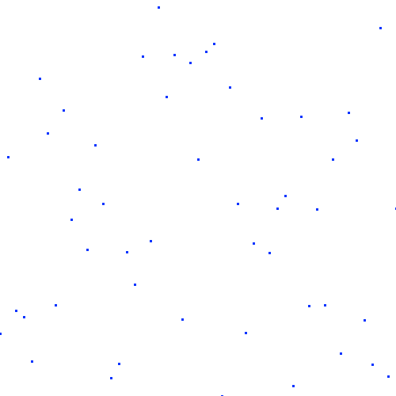

While this example takes advantage of the fact that the `coordinates` attribute is used by both the `segments` and `points` types, you could also assign other attributes to the element to prepare it for being yet a different type as well: each canvas element type will only use the element attributes it requires and will ignore, but remember, any others which may also be specified.

You can also animate random line segments to create a "static" wave like this (this example can be stopped by typing `t:stop()`):

~~~lua
c = require("hs._asm.canvas")
a = c.new{ x = 100, y = 100, h = 500, w = 500 }:show()
a[1] = { type = "segments", closed = false, strokeColor = { blue = 1 }, action = "stroke", strokeWidth = 2 }
t = hs.timer.doEvery(.1, function()
    local z = {}
    for i = 0, 500, 10 do
        table.insert(z, { x = i, y = math.random(500) })
    end
    a[1].coordinates = z
end)
~~~

- - -

### Using a Canvas as an Image for Other Modules

Many modules in Hammerspoon allow the use of an image for various purposes; e.g. the menu title or entries for `hs.menubar`, button images for `hs.toolbar`, etc.  Instead of having to rely on an image which can be described through ASCIIArt or saved as an external file, you can use a canvas object and turn it into an image instead.  For example, the following shows a menu whose item toggles each time you view the menu:

~~~lua
local canvas = require("hs._asm.canvas")
local imageHolder = canvas.new{x = 10, y = 10, h = 50, w = 50}

-- build an image which contains the command key image (I know we could do this as text,
-- but what's harder to do as text is the toggled image that follows)
imageHolder[1] = {
    frame = { h = 50, w = 50, x = 0, y = -6 },
    text = hs.styledtext.new("⌘", {
        font = { name = ".AppleSystemUIFont", size = 50 },
        paragraphStyle = { alignment = "center" }
    }),
    type = "text",
}
local menuOn = imageHolder:imageFromCanvas()

-- now we place a red X over the image.  Note that we don't have to start over -- creating an
-- image is "as it looks now"; future changes to the canvas do not affect already existing images.
imageHolder[2] = {
    action = "stroke",
    closed = false,
    coordinates = { { x = 0, y = 0 }, { x = 50, y = 50 } },
    strokeColor = { red = 1.0 },
    strokeWidth = 3,
    type = "segments",
}
imageHolder[3] = {
    action = "stroke",
    closed = false,
    coordinates = { { x = 50, y = 0 }, { x = 0, y = 50 } },
    strokeColor = { red = 1.0 },
    strokeWidth = 3,
    type = "segments",
}
local menuOff = imageHolder:imageFromCanvas()

-- we also don't have to actually ever show the canvas, or even keep it around -- the images
-- are independant of the canvas itself once they have been created.
imageHolder = imageHolder:delete()

myMenu = hs.menubar.new():setTitle("CanvasTest"):setMenu(function()
    local menuItems = {}
    menuIsOff = not menuIsOff
    if menuIsOff then
      table.insert(menuItems, {
          title = "Off",
          image = menuOff
      })
    else
      table.insert(menuItems, {
          title = "On",
          image = menuOn
      })
    end
    return menuItems
end)
~~~

The menu contents will toggle between 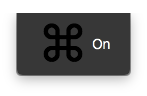 and 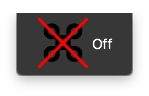.

- - -

### Final Notes

Except for the menu item images, all images shown in this document were generated from within Hammerspoon with the following:

~~~lua
a:imageFromCanvas():saveToFile("name.png")
~~~

