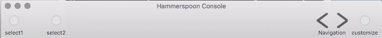
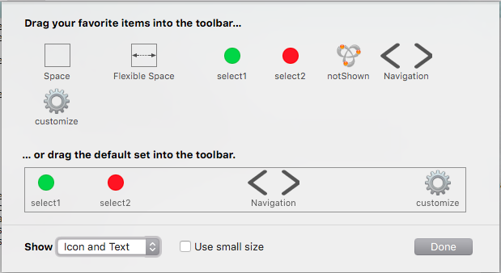

hs._asm.toolbar
===============

***Documentation out of date: expect updates soon which will include new group definition syntax and searchField support.***

Create and manipulate toolbars which can be attached to the Hammerspoon console or hs.webview objects.

### Toolbar Basics

Toolbars are attached to titled windows and provide buttons which can be used to perform various actions within the application.  Hammerspoon can use this module to add toolbars to the console or `hs.webview` objects which have a title bar (see `hs.webview.windowMasks` and `hs.webview:windowStyle`).  Toolbars are identified by a unique identifier which is used by OS X to identify information which can be auto saved in the application's user defaults to reflect changes the user has made to the toolbar button order or active button list (this requires setting [hs._asm.toolbar:autosaves](#autosaves) and [hs._asm.toolbar:canCustomize](#canCustomize) both to true).

Multiple copies of the same toolbar can be made with the [hs._asm.toolbar:copy](#copy) method so that multiple webview windows use the same toolbar, for example.  If the user customizes a copied toolbar, changes to the active buttons or their order will be reflected in all copies of the toolbar.

You cannot add items to an existing toolbar, but you can delete it and re-create it with the same identifier, adding new button items to the new instance.  If the toolbar identifier matches autosaved preferences, the new toolbar will look like it did before, but the user will be able to add the new items by customizing the toolbar or by using the [hs._asm.toolbar:insertItem](#insertItem) method.

### Example

A basic, example:

~~~lua
t = require("hs._asm.toolbar")
a = t.new("myConsole", {
        { id = "select1", selectable = true, image = hs.image.imageFromName("NSStatusAvailable") },
        { id = "NSToolbarSpaceItem" },
        { id = "select2", selectable = true, image = hs.image.imageFromName("NSStatusUnavailable") },
        { id = "notShown", default = false, image = hs.image.imageFromName("NSBonjour") },
        { id = "NSToolbarFlexibleSpaceItem" },
        { id = "navGroup", label = "Navigation",
            { id = "navLeft", image = hs.image.imageFromName("NSGoLeftTemplate") },
            { id = "navRight", image = hs.image.imageFromName("NSGoRightTemplate") }
        },
        { id = "NSToolbarFlexibleSpaceItem" },
        { id = "cust", label = "customize", fn = function(t, w, i) t:customizePanel() end, image = hs.image.imageFromName("NSAdvanced") }
    }):canCustomize(true)
      :autosaves(true)
      :selectedItem("select2")
      :setCallback(function(...)
                        print("a", inspect(table.pack(...)))
                   end)

t.attachToolbar(a)
~~~

Yields: 

with a customization panel which looks like: 

### Installation

A compiled version of this module can (usually) be found in this folder named `toolbar-vX.Y.tar.gz` .  You can download the release and install it by expanding it in your `~/.hammerspoon/` directory (or any other directory in your `package.path` and `package.cpath` search paths):

~~~bash
cd ~/.hammerspoon
tar -xzf ~/Downloads/toolbar-vX.Y.tar.gz # or wherever your downloads are saved
~~~

If this doesn't work for you, or you want to build the latest and greatest, follow the directions below:

This does require that you have XCode or the XCode Command Line Tools installed.  See the App Store application or https://developer.apple.com to install these if necessary.

~~~bash
$ git clone https://github.com/asmagill/hammerspoon_asm
$ cd hammerspoon_asm/toolbar
$ [HS_APPLICATION=/Applications] [PREFIX=~/.hammerspoon] make install
~~~

If Hammerspoon.app is in your /Applications folder, you may leave `HS_APPLICATION=/Applications` out and if you are fine with the module being installed in your Hammerspoon configuration directory, you may leave `PREFIX=~/.hammerspoon` out as well.  For most people, it will probably be sufficient to just type `make install`.

In either case, if you are upgrading over a previous installation of this module, you must completely quit and restart Hammerspoon before the new version will be fully recognized.

### Usage

~~~lua
toolbar = require("hs._asm.toolbar")
~~~

### Module Constructors

<a name="new"></a>
~~~lua
toolbar.new(toolbarName, toolbarTable) -> toolbarObject
~~~
Creates a new toolbar as defined by the table provided.

Parameters:
 * toolbarName  - a string specifying the name for this toolbar
 * toolbarTable - a table describing the possible items for the toolbar

Table Format:
```
   {
       -- example of a button
       { id = "button1", ... }
       -- example of a button group
       { id = "button2", ..., { id = "sub-button1", ... }, { id = "sub-button2" }, ... }
       ...
   }
```

* A button group is a collection of two or more buttons which are treated as a unit when customizing the active toolbar's look either programmatically with [hs._asm.toolbar:insertItem](#insertItem) and [hs._asm.toolbar:removeItem](#removeItem) or under user control with [hs._asm.toolbar:customizePanel](#customizePanel).

* The following keys are supported. The `id` key is the only required key for each button and button group. Unless otherwise specified below, keys can be modified per item after toolbar creation.
   * `id`         - a unique string identifier for the button or button group within the toolbar.
   * `label`      - a string text label, or false to remove, for the button or button group when text is displayed in the toolbar or in the customization panel.  For a button, the default is the `id`; for a button group, the default is `false`.  If a button group has a label, the group label will be displayed for the group of buttons it comprises.  If a button group does not have a label, the individual buttons which make up the group will each display their individual labels.
   * `tooltip`    - a string label, or `false` to remove, which is displayed as a tool tip when the user hovers the mouse over the button or button group.  If a button is in a group, it's tooltip is ignored in favor of the group tooltip.
   * `image`      - an `hs.image` object, or false to remove, specifying the image to use as the button's icon when icon's are displayed in the toolbar or customization panel.  Defaults to a round gray circle (`hs.image.systemImageNames.StatusNone`) for buttons.  This key is ignored for a button group, but not for it's individual buttons.
   * `priority`   - an integer value used to determine button order and which buttons are displayed or put into the overflow menu when the number of buttons in the toolbar exceed the width of the window in which the toolbar is attached.  Some example values are provided in the [hs._asm.toolbar.itemPriorities](#itemPriorities) table.  If a button is in a button group, it's priority is ignored and the button group is ordered by the button group's priority.
   * `tag`        - an integer value which can be used for custom purposes.
   * `enabled`    - a boolean value indicating whether or not the button is active (and can be clicked on) or inactive and greyed out.
   * `fn`         - a callback function, or false to remove, specific to the button.  This property is ignored if assigned to the button group.  This function will override the toolbar callback defined with [hs._asm.toolbar:setCallback](#setCallback) for this specific button.  The function should expect three arguments and return none: the toolbar object, "console" or the webview object the toolbar is attached to, and the toolbar item identifier that was clicked.
   * `default`    - a boolean value, default true, indicating whether or not this button or button group should be displayed in the toolbar by default, unless overridden by user customization or a saved configuration (when such options are enabled).  This key cannot be changed after the toolbar has been created.
   * `selectable` - a boolean value, default false, indicating whether or not this button or button group is selectable (i.e. highlights, like a selected tab) when clicked on.  Only one selectable button will be selected at a time and can be identifier or changed with [hs._asm.toolbar:selectedItem](#selectedItem).  This key cannot be changed after the toolbar has been created.

Returns:
 * a toolbarObject

Notes:
 * Toolbar names must be unique, but a toolbar may be copied with [hs._asm.toolbar:copy](#copy) if you wish to attach it to multiple windows (webview or console).

### Module Functions

<a name="allowedItems"></a>
~~~lua
toolbar:allowedItems() -> array
~~~
Returns an array of all toolbar item identifiers defined for this toolbar.

Parameters:
 * None

Returns:
 * a table as an array of all toolbar item identifiers defined for this toolbar.  See also [hs._asm.toolbar:items](#items) and [hs._asm.toolbar:visibleItems](#visibleItems).

- - -

<a name="attachToolbar"></a>
~~~lua
toolbar.attachToolbar(obj1, [obj2]) -> obj1
~~~
Attach a toolbar to the console or webview.

Parameters:
 * obj1 - if this is the only argument and is a toolbar object or `nil`, attaches or removes a toolbar from the Hammerspoon console window.  If this is an hs.webview object, then `obj2` is required.
 * obj2 - if obj1 is an hs.webview object, then this argument is a toolbar object or `nil` to attach or remove the toolbar from the webview object.

Returns:
 * obj1

Notes:
 * If the toolbar is currently attached to a window when this function is called, it will be detached from the original window and attached to the new one specified by this function.
 * This function is added to the hs.webview object methods so that it may be used as `hs.webview:attachToolbar(obj2)`.

### Module Methods

<a name="autosaves"></a>
~~~lua
toolbar:autosaves([bool]) -> toolbarObject | bool
~~~
Get or set whether or not the toolbar autosaves changes made to the toolbar.

Parameters:
 * an optional boolean value indicating whether or not changes made to the visible toolbar items or their order is automatically saved.

Returns:
 * if an argument is provided, returns the toolbar object; otherwise returns the current value

Notes:
 * If the toolbar is set to autosave, then a user-defaults entry is created in org.hammerspoon.Hammerspoon domain with the key "NSToolbar Configuration XXX" where XXX is the toolbar identifier specified when the toolbar was created.
 * The information saved for the toolbar consists of the following:
   * the default item identifiers that are displayed when the toolbar is first created or when the user drags the default set from the customization panel.
   * the current display mode (icon, text, both)
   * the current size mode (regular, small)
   * whether or not the toolbar is currently visible
   * the currently shown identifiers and their order
* Note that the labels, icons, callback functions, etc. are not saved -- these are determined at toolbar creation time or by the [hs._asm.toolbar:modifyItem](#modifyItem) method and can differ between invocations of toolbars with the same identifier and button identifiers.

- - -

<a name="canCustomize"></a>
~~~lua
toolbar:canCustomize([bool]) -> toolbarObject | bool
~~~
Get or set whether or not the user is allowed to customize the toolbar with the Customization Panel.

Parameters:
 * an optional boolean value indicating whether or not the user is allowed to customize the toolbar.

Returns:
 * if an argument is provided, returns the toolbar object; otherwise returns the current value

Notes:
 * the customization panel can be pulled up by right-clicking on the toolbar or by invoking [hs._asm.toolbar:customizePanel](#customizePanel).

- - -

<a name="customizePanel"></a>
~~~lua
toolbar:customizePanel() -> toolbarObject
~~~
Opens the toolbar customization panel.

Parameters:
 * None

Returns:
 * the toolbar object

- - -

<a name="copy"></a>
~~~lua
toolbar:copy() -> toolbarObject
~~~
Returns a copy of the toolbar object.

Parameters:
 * None

Returns:
 * a copy of the toolbar which can be attached to another window (webview or console).

- - -

<a name="delete"></a>
~~~lua
toolbar:delete() -> none
~~~
Deletes the toolbar, removing it from its window if it is currently attached.

Parameters:
 * None

Returns:
 * None

- - -

<a name="displayMode"></a>
~~~lua
toolbar:displayMode([mode]) -> toolbarObject
~~~
Get or set the toolbar's display mode.

Parameters:
 * mode - an optional string to set the size of the toolbar to "default", "label", "icon", or "both".

Returns:
 * if an argument is provided, returns the toolbar object; otherwise returns the current value

- - -

<a name="identifier"></a>
~~~lua
toolbar:identifier() -> identifier
~~~
The identifier for this toolbar.

Parameters:
 * None

Returns:
 * The identifier for this toolbar.

- - -

<a name="insertItem"></a>
~~~lua
toolbar:insertItem(id, index) -> toolbarObject
~~~
Insert or move the toolbar item to the index position specified

Parameters:
 * id    - the string identifier of the toolbar item
 * index - the numerical position where the toolbar item should be inserted/moved to.

Returns:
 * the toolbar object

Notes:
 * the toolbar position must be between 1 and the number of currently active toolbar items.

- - -

<a name="isAttached"></a>
~~~lua
toolbar:isAttached() -> boolean
~~~
Returns a boolean indicating whether or not the toolbar is currently attached to a window.

Parameters:
 * None

Returns:
 * a boolean indicating whether or not the toolbar is currently attached to a window.

- - -

<a name="items"></a>
~~~lua
toolbar:items() -> array
~~~
Returns an array of the current toolbar item identifiers.

Parameters:
 * None

Returns:
 * a table as an array of the current toolbar item identifiers.  Toolbar items which are in the overflow menu *are* included in this array.  See also [hs._asm.toolbar:visibleItems](#visibleItems) and [hs._asm.toolbar:allowedItems](#allowedItems).

- - -

<a name="isCustomizing"></a>
~~~lua
toolbar:isCustomizing() -> bool
~~~
Indicates whether or not the customization panel is currently open for the toolbar.

Parameters:
 * None

Returns:
 * true or false indicating whether or not the customization panel is open for the toolbar

- - -

<a name="itemDetails"></a>
~~~lua
toolbar:itemDetails(id) -> table
~~~
Returns a table containing details about the specified toolbar item

Parameters:
 * id - a string identifier specifying the toolbar item

Returns:
 * a table which will contain one or more of the follow key-value pairs:
   * id         - a string containing the toolbar item's identifier
   * label      - a string containing the toolbar item's label
   * tooltip    - a string containing the toolbar item's tooltip
   * image      - an hs.image object contining the toolbar item's image
   * priority   - an integer specifying the toolbar item's visibility priority
   * enable     - a boolean indicating whether or not the toolbar item is currently enabled
   * tag        - an integer specifying the toolbar item's user defined tag value
   * toolbar    - the toolbar object the toolbar item is attached to
   * selectable - a boolean indicating whether or not the toolbar item is defined as selectable
   * subitems   - if this item is a toolbar group, a table containing the toolbar items in the group.

- - -

<a name="modifyItem"></a>
~~~lua
toolbar:modifyItem(table) -> toolbarObject
~~~
Modify the toolbar item specified by the "id" key in the table argument.

Parameters:
 * a table containing an "id" key and one or more of the following keys:
   * id         - a string containing the toolbar item's identifier (required)

   * `label`      - a string text label, or false to remove, for the button or button group when text is displayed in the toolbar or in the customization panel.
   * `tooltip`    - a string label, or `false` to remove, which is displayed as a tool tip when the user hovers the mouse over the button or button group.
   * `image`      - an `hs.image` object, or false to remove, specifying the image to use as the button's icon when icon's are displayed in the toolbar or customization panel.
   * `priority`   - an integer value used to determine button order and which buttons are displayed or put into the overflow menu when the number of buttons in the toolbar exceed the width of the window in which the toolbar is attached.  Some example values are provided in the [hs._asm.toolbar.itemPriorities](#itemPriorities) table.
   * `tag`        - an integer value which can be used for custom purposes.
   * `enabled`    - a boolean value indicating whether or not the button is active (and can be clicked on) or inactive and greyed out.
   * `fn`         - a callback function, or false to remove, specific to the button.  This function will override the toolbar callback defined with [hs._asm.toolbar:setCallback](#setCallback) for this specific button.  The function should expect three arguments and return none: the toolbar object, "console" or the webview object the toolbar is attached to, and the toolbar item identifier that was clicked.

Returns:
 * the toolbarObject

- - -

<a name="notifyOnChange"></a>
~~~lua
toolbar:notifyOnChange([bool]) -> toolbarObject | bool
~~~
Get or set whether or not the global callback function is invoked when a toolbar item is added or removed from the toolbar.

Parameters:
 * an optional boolean value to enable or disable invoking the global callback for toolbar changes.

Returns:
 * if an argument is provided, returns the toolbar object; otherwise returns the current value

- - -

<a name="removeItem"></a>
~~~lua
toolbar:removeItem(index) -> toolbarObject
~~~
Remove the toolbar item at the index position specified

Parameters:
 * index - the numerical position of the toolbar item to remove.

Returns:
 * the toolbar object

Notes:
 * the toolbar position must be between 1 and the number of currently active toolbar items.

- - -

<a name="savedSettings"></a>
~~~lua
toolbar:savedSettings() -> table
~~~
Returns a table containing the settings which will be saved for the toolbar if [hs._asm.toolbar:autosaves](#autosaves) is true.

Parameters:
 * None

Returns:
 * a table containing the toolbar settings

Notes:
 * If the toolbar is set to autosave, then a user-defaults entry is created in org.hammerspoon.Hammerspoon domain with the key "NSToolbar Configuration XXX" where XXX is the toolbar identifier specified when the toolbar was created.
 * This method is provided if you do not wish for changes to the toolbar to be autosaved for every change, but may wish to save it programmatically under specific conditions.

- - -

<a name="selectedItem"></a>
~~~lua
toolbar:selectedItem([item]) -> toolbarObject | item
~~~
Get or set the selected toolbar item

Parameters:
 * item - an optional id for the toolbar item to show as selected, or nil if you wish for no toolbar item to be selected.

Returns:
 * if an argument is provided, returns the toolbar object; otherwise returns the current value

Notes:
 * Only toolbar items which were defined as `selectable` when created with [hs._asm.toolbar.new](#new) can be selected with this method.

- - -

<a name="separator"></a>
~~~lua
toolbar:separator([bool]) -> toolbarObject | bool
~~~
Get or set whether or not the toolbar shows a separator between the toolbar and the main window contents.

Parameters:
 * an optional boolean value to enable or disable the separator.

Returns:
 * if an argument is provided, returns the toolbar object; otherwise returns the current value

- - -

<a name="setCallback"></a>
~~~lua
toolbar:setCallback(fn | nil) -> toolbarObject
~~~
Sets or removes the global callback function for the toolbar.

Parameters:
 * fn - a function to set as the global callback for the toolbar, or nil to remove the global callback.

 The function should expect three arguments and return none: the toolbar object, "console" or the webview object the toolbar is attached to, and the toolbar item identifier that was clicked.
Returns:
 * the toolbar object.

Notes:
 * the global callback function is invoked for a toolbar button item that does not have a specific function assigned directly to it.
 * if [hs._asm.toolbar:notifyOnChange](#notifyOnChange) is set to true, then this callback function will also be invoked when a toolbar item is added or removed from the toolbar either programmatically with [hs._asm.toolbar:insertItem](#insertItem) and [hs._asm.toolbar:removeItem](#removeItem) or under user control with [hs._asm.toolbar:customizePanel](#customizePanel) and the callback function will receive a string of "add" or "remove" as a fourth argument.

- - -

<a name="sizeMode"></a>
~~~lua
toolbar:sizeMode([size]) -> toolbarObject
~~~
Get or set the toolbar's size.

Parameters:
 * size - an optional string to set the size of the toolbar to "default", "regular", or "small".

Returns:
 * if an argument is provided, returns the toolbar object; otherwise returns the current value

- - -

<a name="visible"></a>
~~~lua
toolbar:visible([bool]) -> toolbarObject | bool
~~~
Get or set whether or not the toolbar is currently visible in the window it is attached to.

Parameters:
 * an optional boolean value to show or hide the toolbar.

Returns:
 * if an argument is provided, returns the toolbar object; otherwise returns the current value

- - -

<a name="visibleItems"></a>
~~~lua
toolbar:visibleItems() -> array
~~~
Returns an array of the currently visible toolbar item identifiers.

Parameters:
 * None

Returns:
 * a table as an array of the currently visible toolbar item identifiers.  Toolbar items which are in the overflow menu are *not* included in this array.  See also [hs._asm.toolbar:items](#items) and [hs._asm.toolbar:allowedItems](#allowedItems).

### Module Constants

<a name="itemPriorities"></a>
~~~lua
toolbar.itemPriorities
~~~
A table containing some pre-defined toolbar item priority values for use when determining item order in the toolbar.

Defined keys are:
 * standard - the default priority for an item which does not set or change its priority
 * low      - a low priority value
 * high     - a high priority value
 * user     - the priority of an item which the user has added or moved with the customization panel

- - -

<a name="systemToolbarItems"></a>
~~~lua
toolbar.systemToolbarItems
~~~
An array containing string identifiers for supported system defined toolbar items.

Currently supported identifiers include:
 * NSToolbarSpaceItem         - represents a space approximately the size of a toolbar item
 * NSToolbarFlexibleSpaceItem - represents a space that stretches to fill available space in the toolbar

### Debugging Support

<a name="infoDump"></a>
~~~lua
toolbar:infoDump() -> table
~~~
Returns information useful for debugging

Parameters:
 * None

Returns:
 * a table containing information stored in the HSToolbar object for debugging purposes.

### License

> Released under MIT license.
>
> Copyright (c) 2016 Aaron Magill
>
> Permission is hereby granted, free of charge, to any person obtaining a copy of this software and associated documentation files (the "Software"), to deal in the Software without restriction, including without limitation the rights to use, copy, modify, merge, publish, distribute, sublicense, and/or sell copies of the Software, and to permit persons to whom the Software is furnished to do so, subject to the following conditions:
>
> The above copyright notice and this permission notice shall be included in all copies or substantial portions of the Software.
>
> THE SOFTWARE IS PROVIDED "AS IS", WITHOUT WARRANTY OF ANY KIND, EXPRESS OR IMPLIED, INCLUDING BUT NOT LIMITED TO THE WARRANTIES OF MERCHANTABILITY, FITNESS FOR A PARTICULAR PURPOSE AND NONINFRINGEMENT. IN NO EVENT SHALL THE AUTHORS OR COPYRIGHT HOLDERS BE LIABLE FOR ANY CLAIM, DAMAGES OR OTHER LIABILITY, WHETHER IN AN ACTION OF CONTRACT, TORT OR OTHERWISE, ARISING FROM, OUT OF OR IN CONNECTION WITH THE SOFTWARE OR THE USE OR OTHER DEALINGS IN THE SOFTWARE.
